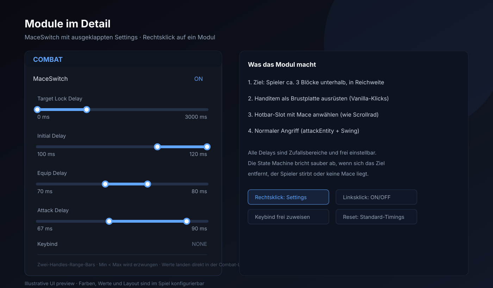

# Gugugaga Client

[](https://minecraft.net)
[](https://fabricmc.net)
[](LICENSE)
[](https://github.com/fakten60-svg/Minecraft-mace-mod-1/actions/workflows/build.yml)
[](https://github.com/fakten60-svg/Minecraft-mace-mod-1/releases)

Client-seitige Fabric-Mod für **Minecraft 1.21.11**: Führt eine automatisierte Aerial-Mace-Sequenz
aus, sobald du **ca. 3 Blöcke über einem anderen Spieler** bist — Chestplate ausrüsten, auf die
Mace wechseln, angreifen. Alles über normale Client-Eingaben, mit zufälligen Delays.

> ⚠️ **Fair-Play-Hinweis:** Automatisierung verstößt auf vielen Servern gegen die Regeln.
> Nutzung auf eigene Verantwortung, gedacht für Testumgebungen und eigene Server.

## Vorschau

| ClickGUI | Modul-Settings | HUD-Editor |
| --- | --- | --- |
|  |  |  |

## Features

- **Aerial-Mace-Sequenz** als nicht-blockierende State Machine mit zufälligen Delays
  (Initial 100–120 ms, Equip → Mace 70–80 ms, Mace → Attack 67–90 ms, alle frei einstellbar)
- **ClickGUI** (**Right Shift**) mit Panels, Zwei-Handles-Range-Bars, Slidern, Themes,
  Color Picker, Suche und Keybinds (Module standardmäßig auf NONE)
- **HUD** mit Watermark, FPS, Koordinaten, Speed und aktiven Modulen — frei positionierbar
  über den **HUD-Editor (F8)**
- **Profile (F6)**, **Friends (F7)**, **Cloud-Configs (F9)**
- Alles wird persistent gespeichert; kaputte Configs können den Client nicht crashen

## Funktionsweise

```
IDLE → TARGET_FOUND → Initial Delay → EQUIP_CHESTPLATE → Equip Delay
     → SWITCH_TO_MACE → Mace Delay → ATTACK → Post-Attack Cooldown → IDLE
```

Start nur, wenn du lebst, ein anderes Spieler-Ziel existiert, `playerY - targetY` im
Toleranzfenster (Standard 2,85–3,25) liegt und das Ziel in Reichweite ist. Vor jedem
Übergang wird neu geprüft und bei Ungültigkeit sauber abgebrochen.

## Installation

1. [Fabric Loader](https://fabricmc.net/use/installer/) für 1.21.11 installieren
2. [Fabric API](https://modrinth.com/mod/fabric-api) in den `mods`-Ordner
3. Mod-JAR aus den [Releases](../../releases) in den `mods`-Ordner
4. Minecraft mit dem Fabric-Profil für 1.21.11 starten

Selbst bauen: `./gradlew build` (JDK 21), JAR liegt unter `build/libs/`.

## Steuerung

| Taste | Aktion |
| --- | --- |
| **Right Shift** | ClickGUI öffnen/schließen |
| **F6** | Profile-Manager |
| **F7** | Friends-Manager |
| **F8** | HUD-Editor |
| **F9** | Cloud-Configs |
| **F10** | Debug-Overlay (FPS, Versionen, Config-Status) |

## Cloud-Configs

Wir haben **Cloud-Configs**: Im Spiel (**F9**) kannst du deine Client-Config hochladen und
Configs von anderen Spielern direkt laden. Betrieben wird das über ein kostenloses
Supabase-Projekt (Free Plan reicht dauerhaft) — Setup einmalig per
[`docs/supabase-cloud-configs.sql`](docs/supabase-cloud-configs.sql). Sicher durch
öffentlichen anon key, RLS, Upload-Drossel und automatisch begrenzter Tabelle —
Details stehen im SQL-File.

## Releases

Ein Push eines Version-Tags (`git tag v1.1.0 && git push origin v1.1.0`) baut die Mod per
GitHub Actions und hängt die fertige JAR automatisch ans Release. Die Version steht in
[`gradle.properties`](gradle.properties). Jeder Push auf `main` wird zusätzlich durch
CI geprüft.

## Website

Das Projekt hat eine eigene statische Website im Ordner [`website/`](website/)
(Home, Features, Download, Dokumentation, Changelog, FAQ) — kein Build-Step,
keine Abhängigkeiten. Details: [`website/README.md`](website/README.md).

## Technik

Minecraft 1.21.11 · Fabric Loader ≥ 0.19.5 · Fabric API 0.141.6+1.21.11 ·
Yarn 1.21.11+build.6 · Java 21 · Loom 1.17.21

Details: [`CHANGELOG.md`](CHANGELOG.md) · [`CONTRIBUTING.md`](CONTRIBUTING.md) · [MIT](LICENSE)
