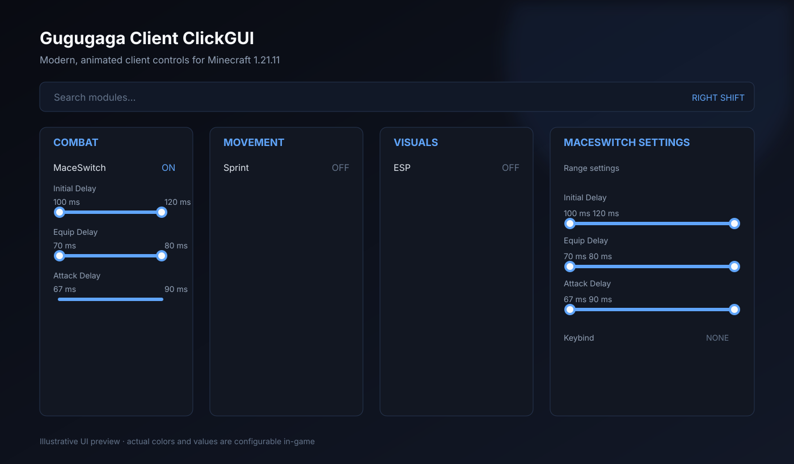
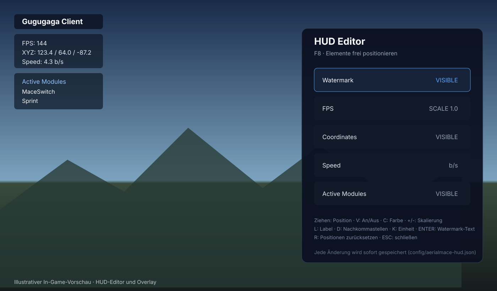

# Aerial Mace Automation

[](https://minecraft.net)
[](https://fabricmc.net)
[](LICENSE)
[](https://github.com/fakten60-svg/Minecraft-mace-mod-1/actions/workflows/build.yml)
[](https://github.com/fakten60-svg/Minecraft-mace-mod-1/releases)

Client-seitige Fabric-Mod für **Minecraft Java Edition 1.21.11**, die eine automatisierte
Aerial-Mace-Sequenz ausführt, sobald sich der eigene Spieler **ungefähr 3 Blöcke über einem
anderen Spieler** befindet.

> ⚠️ **Fair-Play-Hinweis:** Automatisierte Abläufe verstoßen gegen die Serverregeln vieler
> Multiplayer-Server. Diese Mod ist für Testumgebungen und eigene Server gedacht. Die Nutzung
> erfolgt auf eigene Verantwortung.

---

## Funktionsweise

Sind alle Startbedingungen erfüllt, läuft folgende Sequenz ab:

```
IDLE
 ↓  (Ziel erkannt: Spieler ~3 Blöcke unterhalb, in Reichweite)
TARGET_FOUND
 ↓  Target Lock Delay:   zufällig konfigurierbar (Standard 0 ms)
TARGET_LOCK_DELAY
 ↓  Initial Delay:       zufällig 100–120 ms
EQUIP_CHESTPLATE        (Item in der Hand via Vanilla-Inventarklick als Brustplatte ausrüsten)
 ↓  Equip → Mace Delay: zufällig 70–80 ms
SWITCH_TO_MACE          (Hotbar-Slot mit einer Mace, wie ein normaler Hotbar-Wechsel)
 ↓  Mace → Attack Delay: zufällig 67–90 ms
ATTACK                  (normaler Angriff: attackEntity + Swing, wie ein echter Linksklick)
 ↓  Post-Attack Cooldown: zufällig konfigurierbar (Standard 0 ms)
POST_ATTACK_DELAY
 ↓
IDLE
```

### Startbedingungen

Die Sequenz startet nur, wenn **alle** Bedingungen erfüllt sind:

- Der Client ist in einer Welt (Singleplayer oder Server) verbunden.
- Der eigene Spieler lebt und ist nicht im Zuschauermodus.
- Ein anderer Spieler wurde als Ziel erkannt.
- Die vertikale Differenz `playerY - targetY` liegt im konfigurierbaren Fenster
  (Standard: **2,85 – 3,25 Blöcke**, also „≈ 3 Blöcke“ mit Toleranz).
- Das Ziel liegt innerhalb der konfigurierbaren Reichweite
  (Standard: max. **5,5 Blöcke** gesamt / **4,5 Blöcke** horizontal).
- Es läuft gerade keine Sequenz.

### Abbruchbedingungen

Die State Machine prüft vor **jedem** Übergang die Voraussetzungen neu und bricht sauber ab
(Hotbar-Slot wird zurückgesetzt), wenn:

- das Mod deaktiviert wird (Taste **M**),
- der Spieler stirbt, in den Zuschauermodus wechselt oder die Welt verlässt,
- das Ziel verschwindet, stirbt oder das Höhen-/Distanzfenster verlässt,
- keine Mace in der Hotbar liegt,
- das getragene Handitem keine Brustplatte ist,
- die Sequenz nach 5 Sekunden noch nicht abgeschlossen ist (Timeout).

### „Wie normale Spielereingaben“

Die Mod nutzt bewusst ausschließlich vorhandene Client-Mechanismen:

| Aktion | Mechanismus |
| --- | --- |
| Chestplate ausrüsten | `ClientPlayerInteractionManager.clickSlot(...)` – dieselben Pakete wie ein Shift-Klick im Inventar |
| Mace anwählen | `PlayerInventory.setSelectedSlot(...)` + `UpdateSelectedSlotC2SPacket` – identisch zum Scrollrad |
| Angriff | `interactionManager.attackEntity(...)` + `player.swingHand(...)` – identisch zu einem echten Linksklick |

Keine direkten Server-Zustandsänderungen, keine gepanzerten Interna – nur der reguläre
Interaktionspfad des Clients.

---

## Vorschau

Die folgenden Bilder zeigen die beabsichtigte Oberfläche des Clients. Sie sind bewusst als
Illustrationen gekennzeichnet; Farben, Positionen, Maßstab und sichtbare Elemente können im Spiel
konfiguriert werden.

### ClickGUI



### HUD-Editor und Overlay



## Installation (für Spieler)

1. [Fabric Loader](https://fabricmc.net/use/installer/) für 1.21.11 installieren.
2. [Fabric API](https://modrinth.com/mod/fabric-api) herunterladen und in den `mods`-Ordner legen.
3. Die Mod-JAR aus den [Releases](../../releases) (oder selbst gebaut: `build/libs/`) in den
   `mods`-Ordner legen.
4. Minecraft mit dem Fabric-Profil für 1.21.11 starten.

## Selbst bauen

Voraussetzungen: **JDK 21**

```bash
./gradlew build
```

Die fertige Mod liegt danach unter `build/libs/aerial-mace-automation-<version>.jar`
(die `-sources.jar` ist nur für Entwickler).

## Konfiguration

Die Datei `config/aerialmace.json` wird beim ersten Start automatisch erzeugt:

```json
{
  "enabled": true,
  "requireSneaking": false,
  "ignoreFriends": true,
  "targetHeightMin": 2.85,
  "targetHeightMax": 3.25,
  "maxTargetDistance": 5.5,
  "maxHorizontalDistance": 4.5,
  "targetLockDelayMin": 0,
  "targetLockDelayMax": 0,
  "initialDelayMin": 100,
  "initialDelayMax": 120,
  "equipToMaceDelayMin": 70,
  "equipToMaceDelayMax": 80,
  "maceToAttackDelayMin": 67,
  "maceToAttackDelayMax": 90,
  "postAttackDelayMin": 0,
  "postAttackDelayMax": 0,
  "overlayMessages": true,
  "cloudShareUrl": "",
  "cloudShareKey": "",
  "cloudAuthor": ""
}
```

| Schlüssel | Bedeutung |
| --- | --- |
| `enabled` | Master-Schalter (auch in-game per Taste **M** umschaltbar) |
| `requireSneaking` | Sequenz nur starten, während gesneakt wird |
| `ignoreFriends` | Friends aus der Zielauswahl ausschließen (Standard: true) |
| `targetHeightMin/Max` | Toleranzfenster für `playerY - targetY` (Standard ≈ 3 Blöcke) |
| `maxTargetDistance` | maximale Gesamt-Distanz zum Ziel |
| `maxHorizontalDistance` | maximale horizontale Distanz zum Ziel |
| `targetLockDelayMin/Max` | zusätzlicher Delay nach Zielerkennung zum Stabilisieren (ms, Standard 0) |
| `initialDelayMin/Max` | Delay vor dem Ausrüsten (ms, inklusive) |
| `equipToMaceDelayMin/Max` | Delay zwischen Ausrüsten und Mace-Wechsel (ms, inklusive) |
| `maceToAttackDelayMin/Max` | Delay zwischen Mace-Wechsel und Angriff (ms, inklusive) |
| `postAttackDelayMin/Max` | Cooldown nach dem Angriff vor dem nächsten Durchlauf (ms, Standard 0) |
| `overlayMessages` | Statusmeldungen über der Hotbar anzeigen |
| `cloudShareUrl` | Supabase Project URL für die geteilten Cloud-Configs |
| `cloudShareKey` | öffentlicher Supabase anon key (kein Service-Key) |
| `cloudAuthor` | Anzeigename beim Hochladen einer Cloud-Config |

Kaputte oder fehlte Werte werden beim Start automatisch auf zulässige Bereiche korrigiert.

## Steuerung & ClickGUI

| Taste | Aktion |
| --- | --- |
| **Right Shift** (Standard, änderbar) | ClickGUI öffnen/schließen |
| **ESC** | ClickGUI schließen |

### ClickGUI

Die GUI öffnet sich mit **Right Shift** und zeigt vier Kategorien als frei bewegliche
Panels: **Combat, Visuals, Movement, Misc**. Die Module werden automatisch aus dem
ModuleManager geladen.

- **Linksklick** auf ein Modul: ON/OFF (animiert)
- **Rechtsklick** auf ein Modul: Settings ein-/ausklappen
- **Random-Delays** (Target Lock/Initial/Equip/Attack/Post-Attack) werden als **Range-Bar mit zwei Handles**
  dargestellt – beide Punkte sind einzeln verschiebbar, Min < Max wird erzwungen, und die
  Combat-Logik übernimmt die Werte sofort.
- **Keybind-Zeile** in jedem Modul: Klick → „Press a key…“, Taste drücken zum Zuweisen,
  **ESC** setzt zurück auf **NONE**. Module haben standardmäßig **keinen** Keybind.
- **Client-Settings-Panel**: GUI-Keybind, GUI-Scale, Animation Speed, Blur, Click Sounds,
  Button zum Öffnen der Cloud-Configs, Search Bar, Panel Borders und Theme
  (Dark/Midnight/Neon/Ocean/Mono). Der Color Picker bietet
  Accent-, Background-, Panel-, Active-, Text-, Secondary-Text-, Border- und Hover-Farben sowie
  Reset-Aktionen (Module Settings, Keybinds, Theme, GUI Layout).
- Panels lassen sich per Drag & Drop verschieben (Header), scrollen bei Überlauf,
  und Positionen/Einstellungen werden persistent gespeichert (`config/aerialmace-gui.json`).
- Globale Suche: Im ClickGUI direkt tippen, um Module nach Name/Beschreibung zu filtern; ein rotes `!`
  markiert doppelte Modul-Keybinds.
- **F9** öffnet den Cloud-Config-Browser (Configs hochladen, suchen und laden). **F6** öffnet den Profil-Manager (Profile erstellen/speichern/laden/löschen), **F7** den Friends-Manager
  (Name eingeben, Enter zum Hinzufügen, `F` zum Filtern, `[remove]` zum Löschen), **F8** den separaten HUD-Editor.
  HUD-Elemente für Watermark, FPS, Koordinaten und aktive Module werden unabhängig vom ClickGUI gerendert
  und ihre Positionen/Sichtbarkeit/Skalierung unter `config/aerialmace-hud.json` gespeichert.

Die GUI schreibt ausschließlich in die bestehende `config/aerialmace.json` (Modul-Sidebar
`MaceSwitch` ↔ Combat-Logik) — es gibt keine parallelen GUI-Werte. Änderungen werden gedrosselt
(maximal vier Schreibvorgänge pro Sekunde) und beim Verlassen der Welt werden Friends unter
`config/aerialmace-friends.json` gespeichert. Friends stehen zentral über `FriendManager` für
Combat und zukünftige Visual-Module bereit; das Combat-Modul ignoriert sie standardmäßig.

## Technik

- **Minecraft:** 1.21.11
- **Fabric Loader:** ≥ 0.19.5
- **Fabric API:** 0.141.6+1.21.11
- **Mappings:** Yarn 1.21.11+build.6
- **Java:** 21
- **Loom:** 1.17.21

### Architektur

```
de.aerialmace
├── AerialMaceClient          # Entrypoint: Config, Keybinding, Tick-Hook
├── config.ModConfig          # JSON-Config (config/aerialmace.json)
├── sequence.SequenceStateMachine  # Nicht-blockierende State Machine (Client-Tick)
├── target.TargetSelector     # Zielerkennung + Re-Validierung
└── util
    ├── Delays                # randomDelay(min, max) – inklusive, nicht-blockierend
    └── InventoryUtils        # Vanilla-Inventarklicks, Mace-Suche, Hotbar-Wechsel
```

Die Sequenz ist vollständig **nicht-blockierend** implementiert: Delays werden als Deadline
gespeichert und im Client-Tick geprüft – es gibt nirgends `Thread.sleep()`. Aktionen laufen im
selben Tick, in dem die Delay-Deadline abläuft, damit das konfigurierte Timing exakt bleibt.

## Cloud-Configs

Cloud-Configs sind für die **Client-Konfigurationen** gedacht: Jeder kann seine aktuelle
Client-Config hochladen und die Configs anderer Spieler direkt im Spiel durchsuchen und laden.
Releases laufen davon unabhängig weiter wie bisher.

### Einrichtung (einmalig, für den Betreiber)

1. Projekt bei Supabase anlegen.
2. SQL aus [`docs/supabase-cloud-configs.sql`](docs/supabase-cloud-configs.sql) im SQL-Editor ausführen.
   Das legt die Tabelle `aerialmace_configs` und die Policies an: anonymes Lesen und anonymes
   Hochladen erlaubt, Ändern und Löschen nicht.
3. Project URL und den öffentlichen **anon key** notieren.

### Nutzung (im Spiel)

**F9** (oder `Client Settings → Open Cloud Configs`) öffnet den Cloud-Config-Browser:

- `Share URL` – Project URL des Supabase-Projekts
- `Anon Key` – öffentlicher anon key (kein Service-Key, kein Passwort)
- `Author` – Name, der beim Upload angezeigt wird
- `Upload Name` – Name des Eintrags

Mit **TAB** wechselst du das Feld, **ENTER** lädt die aktuelle Config hoch, ein Klick auf eine Zeile
lädt die jeweilige Cloud-Config herunter und übernimmt sie sofort. **R** aktualisiert die Liste.

### Sicherheit

- Nur der öffentliche anon key wird verwendet; der Client enthält keine privaten Schlüssel.
- Es wird nichts hochgeladen, ohne dass du ENTER drückst.
- Beim Upload werden nur Gameplay-Werte geteilt. URLs, Keys und Cloud-Schalter bleiben lokal.
- Heruntergeladene Configs können die Cloud-Einstellungen nicht verändern (kein Redirect).
- Nur HTTPS, begrenzte Antwortgröße, alles asynchron, Offline-Betrieb bleibt möglich.

## Releases

Releases sind bewusst getrennt von den Cloud-Configs und laufen wie gewohnt über die
[Releases-Seite](../../releases): die JAR wird mit `./gradlew build` erzeugt und manuell an den
Release angehängt. Es gibt keine Automatik, die Releases mit Cloud-Funktionen verbindet — Cloud ist
ausschließlich für die Client-Configs zuständig.

## Release und Qualitätssicherung

Die veröffentlichte JAR liegt auf der [Releases-Seite](../../releases). Jeder Push auf `main` und
jeder Pull Request wird zusätzlich durch GitHub Actions mit JDK 21 und `./gradlew build` geprüft.
Die Release-JAR wird aus einem sauberen Gradle-Build erzeugt; `*-sources.jar` ist nur für Entwickler.

Weitere Informationen stehen in [`CHANGELOG.md`](CHANGELOG.md) und [`CONTRIBUTING.md`](CONTRIBUTING.md).

## Lizenz

[MIT](LICENSE)
